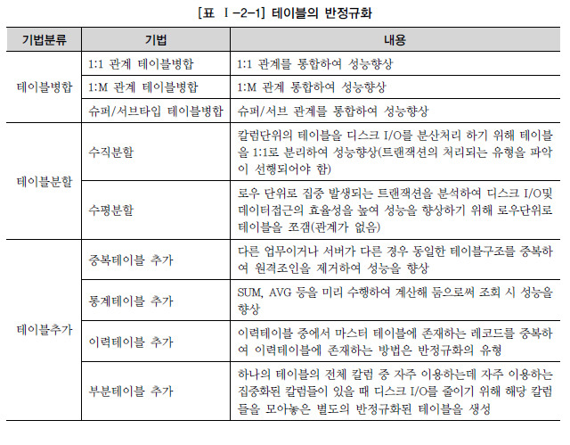
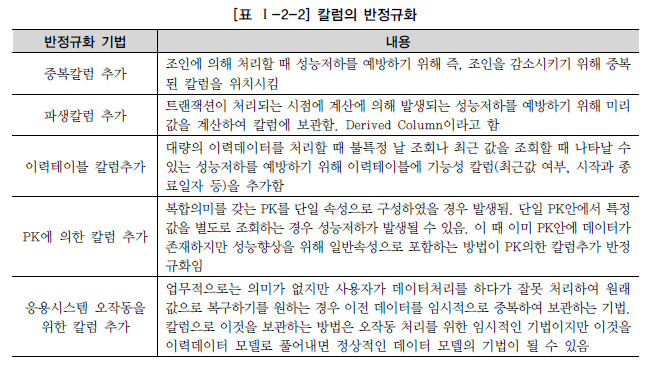
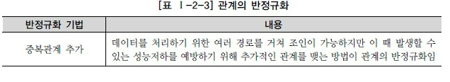

 

## 데이터 모델링
> - 정보시스템을 구축하기 위한 데이터 관점의 업무 분석 기법
> - 현실세계의 데이터에 대해 약속된 표기법에 의해 표현하는 과정
> - 데이터베이스를 구축하기 위한 분석/설계 과정

 

**1) 데이터 모델링 유의점**
- 중복 (Duplication): DB가 여러장소에 같은 정보를 저장 X
- 비유연성 (Inflexibility): 데이터 정의를 데이터 사용 프로세스와 분리
- 비일관성 (Inconsistency): 데이터 간 상호 연관 관계에 대해 명확하게 정의

 

**2) 데이터 모델링의 순서**  
[ 개념적 -> 논리적 -> 물리적 ]  
- 개념적 데이터 모델링: 추상화 수준이 높고 업무중심적이고 포괄적인 수준의 모델링. `전사적 데이터 모델링`, `EA수립` 시 많이 이용
- 논리적 데이터 모델링: 시스템으로 구축하고자 하는 업무에 대해 Key, 속성, 관계 등을 정확하게 표현, `재사용성↑`
- 물리적 데이터 모델링: 실제로 DB에 이식할 수 있도록 성능, 저장 등 물리적 성격을 고려하여 설계

 

**3) 데이터베이스 스키마 구조 3단계**
- 외부스키마 (External Schema): 개인의 입장에서 바라보는 스키마. `사용자 뷰`
- 개념스키마 (Conceptual Schema): 조직 전체의 입장에서 바라보는 스키마. `개체간의 관계와 제약조건, DB의 접근권한/보안/무결성 규칙에 대한 명세 정의`
- 내부스키마 (Internal Schema): 시스템 프로그래머나 설계자의 관점에서 바라보는 스키마. `DB의 물리적 구조`

   

### ERD
- Peter Chen에 의해 Entity-Relationship Model(E-R Model)이라는 표기법이 만들어졌다.
- 일반적으로 ERD 작성 순서는 `엔터티 도출 → 엔터티 배치 → 관계 설정 → 관계명 기술 (→ 관계 참여도 기술 → 관계 필수여부 기술)`의 흐름으로 진행된다.
- 관계의 명칭은 관계 표현에 있어 매우 중요하다.
- 일반적으로 가장 중요한 엔터티는 좌측 상단 → 우측 하단으로 배치한다.

   

### 엔터티 (Entity)
**1) 엔터티의 특징**
- 반드시 해당 업무에서 필요하고 관리하고자 하는 정보이어야 한다.
- 유일한 식별자에 의해 식별이 가능해야 한다.
- 영속적으로 존재하는 `인스턴스의 집합`이어야 한다. (한 개가 아닌 두 개 이상!!)
- 엔터티는 업무 프로세스에 의해 이용되어야 한다.
- 엔터티는 반드시 `속성`이 있어야 한다.
- 엔터티는 다른 엔터티와 최소 한 개 이상의 `관계`가 있어야 한다.

 

**2) 엔터티 명명법**
- 가능한 약어 사용 X
- 단수명사 사용
- 모든 엔터티에서 유일한 이름 부여
- 생성의미대로 이름 부여

 

**3) 발생 시점에 따른 엔터티 분류**
- `기본 엔터티(키 엔터티)`  
    업무에 원래 존재하는 정보.  
    다른 엔터티와의 관계에 의해 발생 또는 생성되지 않고 독립적으로 존재하는 엔터티
- `중심 엔터티(메인 엔터티)`  
    기본 엔터티로 부터 발생한 엔터티. 업무에서 중심적인 역할
- `행위 엔터티`  
    두 개 이상의 부모 엔터티로부터 주로 발생.   
    엔터티의 내용이 자주 바뀌거나 데이터 양이 증감함.  
    분석 초기 단계보다는 상세 설계단계에 주로 도출

   

### 속성
- 업무에서 필요로 하는 인스턴스에서 관리하고자 하는 의미상 **더 이상 분리되지 않는 최소의 데이터 단위**

**1) 속성의 분류**  
**1-1) 속성의 특성에 따른 분류**
- `기본속성`: 업무 분석을 통해 바로 정의한 속성 
- `설계속성`: 업무상 필요한 데이터 이외에 데이터 모델링을 위해, 업무를 규칙화하기 위해 신규로 만들어지거나 변형된 속성
- `파생속성`: 다른 속성에 영향을 받아 발생하는 속성. (데이터 조회 시 빠른 성능을 낼 수 있도록 하기 위해 원래 속성의 값을 계산하여 저장할 수 있도록 만든 속성)  

**1-2) 엔터티 구성 방식에 따른 분류**
- `PK 속성`: 엔터티를 유일하게 구분할 수 있는 속성
- `FK 속성`: 다른 엔터티와의 관계에 있어 포함된 속성
- `일반 속성`: 엔터티에 포함되어 있고, PK와 FK에 포함되지 않는 속성

 

**2) 속성 명명법**
- 해당 업무에서 사용하는 이름 부여
- 서술식 속성명 사용 X
- 가능한 약어 사용 X
- 전체 데이터모델에서 유일성을 확보하는 것이 좋다.

 

**3) 도메인**
- 각 속성은 가질 수 있는 값의 범위가 있는데, 이를 그 속성의 `도메인(Domain)`이라 한다.
- 엔터티 내에서 속성에 대한 데이터타입과 크기, 제약사항을 지정하는 것이다.

   

### 관계
- 엔터티의 인스턴스 간 논리적인 연관성
- 존재나 행위로서 서로에게 연관성이 부여된 상태
- 관계의 분류는 `존재에 의한 관계`와 `행위에 의한 관계`로 구분된다.

**1) 관계의 표기법**
- `관계명`: 엔터티가 관계에 참여하는 형태
- `관계차수`: 1:1, 1:M, M:N
- `관계선택사양`: 필수관계, 선택관계

 

**2) 관계 도출 시 체크사항**
- 두 개의 엔터티 사이에 관심있는 연관규칙이 존재하는가?
- 두 개의 엔터티 사이에 정보의 조합이 발생되는가?
- 업무기술서, 장표에 관계연결에 대한 규칙이 서술되어 있는가?
- 업무기술서, 장표에 관계연결을 가능하게 하는 동사(Verb)가 있는가?

   

> ❓ **엔터티-인스턴스-속성-속성값의 관계**  
> - 한 개의 엔터티는 두 개 이상의 인스턴스의 집합이어야 한다.
> - 한 개의 엔터티는 두 개 이상의 속성을 갖는다.
> - 한 개의 속성은 한 개의 속성값을 갖는다. 

   

### 식별자
- 여러개의 인스턴스를 담고 있는 엔터티에서 인스턴스를 구별하기 위한, 즉 **엔터티를 대표하는 속성**을 의미

**1) 식별자의 종류**
- 엔터티 내에서 **대표성**을 가지는가?
    + `주식별자`: 엔터티 내에서 각 어커런스를 구분할 수 있는 구분자이며, 타 엔터티와 참조관계를 연결할 수 있는 식별자
    + `보조식별자`: 엔터티 내에서 각 어커런스를 구분할 수 있는 구분자이나, 대표성을 가지짐 못해 참조관계 연결은 할 수 없음.

 

- 엔터티 내에서 **스스로** 생성되었는가?
    + `내부식별자`: 엔터티 내부에서 스스로 만들어지는 식별자
    + `외부식별자`: 타 엔터티와의 관계를 통해 타 엔터티로부터 받아오는 식별자

 

- **단일 속성**으로 식별이 되는가?
    + `단일식별자`: 하나의 속성으로 구성된 식별자
    + `복합식별자`: 둘 이상의 속성으로 구성된 식별자

 

- **업무적**으로 의미가 있는가?
    + `본질식별자`: 업무에 의해 만들어지는 식별자
    + `인조식별자`: 업무적으로 만들어지지는 않았으나, 원조식별자가 복잡한 구성을 가지고 있기 때문에 인위적으로 만든 식별자

 

**2) 주식별자의 특징**
- `유일성`: 주식별자에 의해 엔터티내에 모든 인스턴스들을 유일하게 구분
- `최소성`: 주식별자를 구성하는 속성의 수는 유일성을 만족하는 최소의 수가 되어야 함
- `불변성`: 주식별자가 한 번 특정 엔터티에 지정되면 그 식별자의 값은 변하지 않아야 함
- `존재성`: 주식별자가 지정되면 반드시 데이터 값이 존재 (NULL이 X)

 

**3) 식별자 관계와 비식별자 관계**
|항목|식별자 관계|비식별자 관계|
|-|-|-|
|목적|강한 연결관계|약한 연결관계|
|자식 주식별자 영향|자식 주식별자의 구성에 포함됨|자식 일반 속성에 포함됨|
|표기법|실선|점선|
|연결 고려사항|- 반드시 부모 엔터티 종속 - 자식 주식별자 구성에 부모 주식별자 포함 필요 - 상속받은 주식별자 속성을 타 엔터티에 이전 필요|- 약한 종속 관계 - 자식 주식별자 구성을 독립적으로 구성  - 자식 주식별자 구성에 부모 주식별자 부분 필요  - 상속받은 주식별자 속성을 타 엔터티에 차단 필요 - 부모 쪽의 관계참여가 선택 관계|

> 비식별자 관계를 고려해야 하는 경우
> 1. 부모엔터티에 참조값이 없어도 자식엔터티의 인스턴스가 생성될 수 있는 경우
> 2. 부모엔터티가 자식엔터티만 남겨두고 먼저 소멸될 수 있는 경우
> 3. 여러 개의 엔터티를 하나로 통합하면서 각각의 엔터티가 갖고 있던 여러 개의 개별 관계가 통합되는 경우
> 4. 자식쪽 엔터티의 주식별자를 부모엔터티와는 별도로 생성하는 것이 더 유리하다고 판단되는 경우

  

 
 

## 성능 데이터 모델링
- **DB 성능 향상**을 목적으로 설계단계의 데이터 모델링 때부터 성능과 관련된 사항이 데이터 모델링에 반영될 수 있도록 하는 것
- 가능한 사전에 할 수록 (설계 단계) 비용이 절감됨

 

**1) 성능데이터 모델링 고려사항/순서**
1. 데이터모델링 시 정규화를 정확하게 수행
2. 데이터베이스 용량산정 수행
3. 데이터베이스에 발생되는 트랜잭션의 유형 파악
4. 용량과 트랜잭션의 유형에 따라 반정규화 수행
5. 이력모델의 조정, PK/FK조정, 슈퍼타입/서브타입 조정 등을 수행
6. 성능관점에서 데이터모델 검증

   

### 정규화
- 관계형 DB의 설계에서 중복을 최소화할 수 있도록 데이터를 구조화 하는 것
- 정규화 된 정도를 `정규형`이라 함.

**`제 1 정규형`**
- 릴레이션에 속한 모든 속성의 도메인이 원자 값으로만 구성되어 있는 경우

**`제 2 정규형`**
- 제 1정규형에 속하면서, 기본키가 아닌 모든 속성이 기본키에 완전 함수 종속된 경우

**`제 3 정규형`**
- 제 2정규형에 속하면서, 기본키가 아닌 모든 속성이 기본키에 이행적 함수 종속이 되지 않는 경우  
(즉, 기본키에 속하지 않는 컬럼들이 그 외 다른 컬럼들을 결정할 수 없는 것)

  

### 반정규화
- 정규화된 엔터티, 속성, 관계에 대해 시스템의 성능향상과 개발, 운영의 단순화를 위해 중복, 통합, 분리 등을 수행하는 데이터 모델링 기법
- 데이터를 중복하여 성능을 향상시키는 기법
- 성능을 향상시키기 위해 정규화된 데이터 모델에서 중복, 통합, 분리 등을 수행하는 모든 과정

> 📌반정규화를 하는 이유?  
> 데이터 무결성이 깨질 수 있는 위험을 무릅쓰고 데이터를 중복하여 반정규화를 적용하는 이유는, 1. 데이터 조회 시 디스크 I/O량이 많아서 성능이 저하되거나 2. 경로가 너무 멀어 조인으로 인한 성능저하가 예상되거나 3. 컬럼을 계산하여 읽을 때 성능이 저하될 것이 예상되기 때문이다.

 

**1) 반정규화 절차**
1. 반정규화 대상 조사
    - 범위처리빈도수 조사
    - 대량의 범위 처리 조사
    - 통계성 프로세스 조사
    - 테이블 조인 개수
2. 다른 방법유도 검토
    - 뷰(view) 테이블
    - 클러스터링 적용
    - 인덱스의 조정
    - 응용 애플리케이션
3. 반정규화 적용
    - 테이블 반정규화
    - 속성의 반정규화
    - 관계의 반정규화

 

**2) 반정규화의 대상에 대해 다른 방법으로 처리**
- 지나치게 많은 조인(JOIN)이 걸려 데이터를 조회하는 작업이 기술적으로 어려울 경우 `뷰(VIEW)`를 사용하면 이를 해결할 수도 있다.
- 대량의 데이터처리나 부분처리에 의해 성능이 저하되는 경우에 `클러스터링`을 적용하거나 `인덱스`를 조정함으로써 성능을 향상시킬 수 있다.
- 대량의 데이터는 PK의 성격에 따라 부분적인 테이블로 분리하여 성능 저하를 방지할 수 있다. (`파티셔닝`)
- `응용 애플리케이션`에서 로직을 구사하는 방법을 변경함으로써 성능을 향상시킬 수 있다.

 

**3) 반정규화 방법**
- 테이블의 반정규화

 

- 컬럼의 반정규화

 

- 관계의 반정규화

   

### 슈퍼/서브 타입 데이터 모델의 변환 기술
- 개별로 발생되는 트랜잭션에 대해서 개별 테이블로 구성
- 슈퍼타입+서브타입에 대해 발생되는 트랜잭션에 대해서 슈퍼타입+서브타입 테이블로 구성
- 전체를 하나로 묶어 트랜잭션이 발생할 때는 하나의 테이블로 구성

   

### PK 순서 결정 기준 (index를 효율적으로 이용할 수 있도록)
- 여러개의 속성이 하나의 인덱스로 구성되어 있을 때 앞쪽에 위치한 속성의 값이 비교자료 있어야 인덱스가 좋은 효율
- 앞쪽에 위치한 속성 값이 가급적 `=` 아니면 최소한 범위 `BETWEEN`, `<>`가 들어와야 인덱스를 이용할 수 있음

   

### 분산 데이터베이스 장단점
- 장점
    - 지역 자치성, 점증적 시스템 용량 확장
    - 신뢰성과 가용성
    - 효용성과 융통성
    - 빠른 응답 속도와 통신비용 절감
    - 데이터의 가용성과 신뢰성 증가
    - 시스템 규모의 적절한 조절
    - 각 지역 사용자의 요구 수용 증대
- 단점
    - 소프트웨어 개발 비용
    - 오류의 잠재성 증대
    - 처리 비용의 증대
    - 설계, 관리의 복잡성과 비용
    - 불규칙한 응답 속도
    - 통제의 어려움
    - 데이터 무결성에 대한 위협 

 
 

## SQL 기본

 

### SQL 언어
**1) 데이터 조작어 (DML: Data Manipulation Language)** 
- `SELECT`: 데이터 조회
~~~sql
-- *: 컬럼 전체 조회
-- DISTINCT: 중복 데이터 제외
SELECT [* | DISTINCT] FROM 테이블명;
~~~
 

> ❓ SELECT 문장 실행 순서  
> FROM -> WHERE -> GROUP BY -> HAVING -> SELECT -> ORDER BY

 

- `INSERT`: 데이터 삽입    
~~~sql
-- 컬럼리스트를 생략할 경우 전체컬럼을 입력해야 함.
-- 컬럼리스트와 컬럼값을 1:1 매핑하여 작성
INSERT INTO 테이블명 ('컬럼리스트')
VALUES ('컬럼값');
~~~
 

- `UPDATE`: 데이터 수정
~~~sql
UPDATE 테이블명
SET 컬럼명=값;
~~~
 

- `DELETE`: 데이터 삭제
~~~sql
DELETE FROM 테이블명;
~~~
   

**2) 데이터 정의어 (DDL: Data Definition Language)**
> ORACLE에서는 DDL 수행 후 Auto Commit을 수행한다.   
SQL Server에서는 DDL 수행 후에도 Auto Commit 되지 않는다.

 

- `CREATE`: 테이블 생성
>❗️ 테이블 생성 시 주의사항  
> - 테이블명은 중복될 수 없다.
> - 한 테이블 내에서는 컬럼명이 중복될 수 없다.
> - 테이블 이름을 지정하고 각 컬럼들은 괄호 "()" 로 묶어 지정한다.
> - 각 컬럼들은 콤마 "," 로 구분하고, 테이블 생성문의 끝은 항상 세미콜론 ";" 으로 묶어 지정한다.
> - 컬럼 뒤에 데이터 유형은 꼭 지정되어야 한다.
> - 테이블명과 컬럼명은 반드시 문자로 시작해야한다.
> - 허용되는 문자: A-Z, a-z, 0-9, _, $, #
> - 테이블명으로 예약어를 사용할 수 없다.

~~~sql
CREATE TABLE 테이블명 (
    컬럼명1 DataType,
    컬럼명2 DataType,
    ...
);
~~~

 

- `ALTER`: 테이블 수정
~~~sql
ALTER TABLE 테이블명 ADD 추가컬럼명 데이터유형;
ALTER TABLE 테이블명 DROP COLUMN 삭제할컬럼명;

/* 테이블 칼럼에 대한 정의 변경 */
-- ORACLE
ALTER TABLE 테이블명 MODIFY (컬럼명 데이터유형 [NOT NULL]);
-- SQL Server
ALTER TABLE 테이블명 ALTER COLUMN 컬럼명 데이터유형 [NOT NULL];

~~~
 

- `DROP`: 테이블 삭제
~~~sql
-- CASCADE: 외래키로 물린 하위테이블까지 삭제
DROP TABLE 테이블명 [CASCADE CONSTRAINT];
~~~
 

- `TRUNCATE`: 테이블 안의 데이터 삭제
~~~sql
-- 테이블 자체가 삭제되는 것이 아님
-- 해당 테이블의 모든 행들이 제거되지만, 해당 테이블의 스키마 정의는 유지되어있음.
TRUNCATE TABLE 테이블명;
~~~
 

- `RENAME`: 테이블 이름 변경
~~~sql
RENAME 기존테이블명 TO 바꿀테이블명;
~~~
   

> ❓DROP / TURNCATE / DELETE의 차이

|DROP|TURNCATE|DELETE
|-|-|-|
|DDL|DDL 일부 DML의 성격|DML
|Auto Commit|Auto Commit|사용자 Commit
|테이블이 사용했던 Storage를 모두 Release|테이블이 사용했던 Storage중 최초 테이블 생성시 할당된 Storage만 남기고 Release|데이터를 모두 Delete해도 사용했던 Storage는 Release되지 않음
|테이블 정의 자체를 삭제|테이블을 최초 생성된 초기상태로|데이터만 삭제

  

**3) 데이터 제어어 (DCL: Data Control Language)**
- `GRANT`: 권한 부여
~~~sql
-- Ojbect에 대한 권한 부여

-- ROLE을 이용한 권한 부여
~~~
 

- `REVOKE`: 권한 삭제
~~~sql

~~~
   

**4) 트랜잭션 제어어 (TCL: Transation Control Language)**
- `COMMIT`: 트랜잭션을 DB에 반영시키는 명령어
- `ROLLBACK`: 트랜잭션 수행 이전의 상태로 되돌리는 명령어

 

**BEGIN TRANSACTION**
- = BEGIN TRAN
- COMMIT / ROLLBACK으로 트랜잭션 종료
- ROLLBACK 구문을 만날 시 최초의 BEGIN TRAN 시점까지 모두 ROLLBACK이 수행된다.

 

**저장점 (SAVEPOINT)**
- ROLLBACK할 때 전체 작업 롤백이 아니라 현 시점에서 SAVEPOINT까지 트랜잭션의 일부만 롤백할 수 있음.
~~~sql
/* ORACLE */
SAVEPOINT SVPT1;
...
ROLLBACK TO SVPT1;

/* SQL Server */
SAVE TRANSACTION SVTR1;
...
ROLLBACK TRANSACTION SVTR1;
~~~

 

> ❓트랜잭션의 4가지 특성
- `원자성(atomicity)`: 트랜잭션에서 정의된 연산들은 모두 성공적으로 실행 or 전혀 실행되지 않은 상태로 남아있어야 함. (All or Nothing)
- `일관성(consistency)`: 트랜잭션이 실행되기 전의 데이터베이스 내용이 잘못 되어있지 않다면, 트랜잭션이 실행된 이후에도 데이터베이스의 내용에 잘못이 있으면 안된다.
- `고립성(isolation)`: 트랜잭션이 실행되는 도중에 다른 트랜잭션의 영향을 받아 잘못된 결과를 만들어선 안된다.
- `지속성(durability)`: 트랜잭션이 성공적으로 수행되면, 그 트랜잭션이 갱신한 데이터베이스의 내용은 영구적으로 저장된다.

  
  

### 제약조건
- `PRIMARY KEY` (기본키): NOT NULL + UNIQUE
    + 하나의 테이블에 하나만 지정가능하다.
    + 자동으로 Unique index 생성됨
- `UNIQUE` (고유키)
    + 중복 불가
    + NULL은 허용
- `NOT NULL`
    + NULL 허용 X
- `CHECK`
    + 입력 값 범위 제한
    + TRUE or FALSE 논리식 지정
- `FOREIGN KEY` (외래키)
    + 다른 테이블의 기본키 or 고유키를 참조
    + 외래키 값은 NULL이거나 부모테이블 키의 값과 동일해야 함.
    + **외래키 옵션**
        - on delete(ou update) cascade: 부모 데이터 삭제(업데이트) 시 자식 데이터도 삭제(업데이트)
        - on delete(on update) set null: 부모 데이터 삭제(업데이트) 시 자식 데이터도 null값으로 변경
        - on delete(on update) set default: 부모 데이터 삭제(업데이트) 시 자식 데이터를 default값으로 변경
        - on delete(on update) restrict: 참조하고 있을 경우, 데이터 삭제(업데이트) 불가능
        - on delete(on update) no action : default, 아무 일도 하지 않음

 
 

### WHERE 절
- FROM 절 다음에 위치
- 조회되는 데이터의 조건을 설정하여 데이터를 제한

 

**~ 연산자의 종류**  
1) 비교 연산자
    + `=` 같다.
    + `>` 보다 크다.
    + `>=` 보다 크거나 같다.
    + `<` 보다 작다.
    + `<=` 보다 작거나 같다.
2) SQL 연산자
    + `BETWEEN a AND b` a와 b의 값 사이에 있는 값 (a, b 포함)
    + `IN (list)` list에 있는 값들 중 어느하나라도 일치?
    + `LIKE '비교문자열'` 비교문자열과 형태 일치 (%, _)
    + `IS NULL` NULL값인지
3) 논리 연산자
    + `AND` 앞의 조건과 뒤의 조건이 모두 TRUE이면 TRUE
    + `OR` 앞의 조건과 뒤의 조건 중 하나라도 TRUE이면 TRUE
    + `NOT` 조건의 반대 결과 반환
4) 부정 비교 연산자
    + `!=` / `^=` 같지 않다.
    + `<>` 같지 않다. (ISO 표준)
    + `NOT 컬럼명 =` ~와 같지 않다.
    + `NOT 컬럼명 >` ~보다 크지 않다.
5) 부정 SQL 연산자
    + `NOT BETWEEN a AND b` a와 b의 값 사이에 있지 않은 값 (a, b값 포함 X)
    + `NOT IN (list)` list값과 일치하지 않는다.
    + `IS NOT NULL` NULL값을 갖지 않는다.

 

**~ 연산자 우선순위**  
[ () ] -> [ 부정연산자 (NOT) ] -> [ 비교연산자 / SQL비교연산자 ] -> [ 논리 연산자 (AND -> OR) ]

 

**~ NULL의 연산**  
- NULL값과의 연산은 NULL값을 리턴
- NULL값과의 비교연산은 거짓(FALSE)을 리턴
- 특정 값보다 크다, 적다로 표현 불가

 
 

### 함수

#### **1. 내장 함수 (Built-in Function): 벤더에서 제공하는 함수**
- 단일행 함수 (Single-Row Function)
    |종류|내용|함수
    |-|-|-|
    |문자형 함수|문자를 입력하면 문자나 숫자 값 반환|LOWER, UPPER, SUBSTR/SUBSTRING, LENGTH/LEN, LTRIM, RTRIM, TRIM
    |숫자형 함수|숫자를 입력하면 숫자값을 반환|ABS, MOD, ROUND, TRUNC, SIGN, CHR/CHAR, CEIL/CEILING, FLOOR, EXP, LOG, LN, POWER, SIN, COS, TAN
    |날짜형 함수|DATE 타입의 값을 연산|SYSDATE/GETDATE, EXTRACT/DATEPART, TO_NUMBER(TO_CHAR(d, 'YYYY'), YEAR, MONTH, DAY)
    |NULL 관련 함수|NULL 처리를 위한 함수|NVL/ISNULL, NULLIF, COALESCE

- 다중행 함수 (Multi-Row Function)
    + 집계 함수 (Aggregate Function)
    + 그룹 함수 (Group Function)
    + 윈도우 함수 (Window Function)

 

#### **2. 사용자 정의 함수 (User Defined Funciton): 사용자가 정의할 수 있는 함수**

 
 

### GROUP BY - HAVING 절
~~~sql
SELECT [DISTINCT]
컬럼명 [ALIAS명]
FROM 테이블명
[WHERE 조건식]
[GROUP BY
    컬럼(Column)이나 표현식
]
[HAVING 그룹조건식];
~~~
 

**GROUP BY 절과 HAVING 절의 특성**
- GROUP BY 절을 통해 소그룹별 기준을 정한 후, SELECT 절에 집계 함수를 사용한다.
- 집계 함수의 통계 정보는 NULL 값을 가진 행을 제외하고 수행한다.
- GROUP BY 절에서는 SELECT 절과는 달리 ALIAS 명을 사용할 수 없다.
- 집계 함수는 WHERE 절에는 올 수 없다. 
- WHERE 절은 전체 데이터를 GROUP으로 나누기 전에 행들을 미리 제거
- HAVING 절은 GROUP BY 절의 기준 항목이나 소그룹의 집계 함수를 이용한 조건을 표시할 수 있다.
- GROUP BY 절에 의한 소그룹 별로 만들어진 집계 데이터 중, HAVING 절에서 제한 조건을 두어 조건을 만족하는 내용만 출력한다.

 
 

### ORDER BY 절
~~~sql
SELECT 컬럼명 [ALIAS명]
FROM 테이블명
[WHERE 조건식]
[GROUP BY 컬럼이나 표현식]
[HAVING 그룹조건식]
[ORDER BY 컬럼이나 표현식 [ASC 또는 DESC]];

-- ASC: 조회한 데이터를 오름차순으로 정렬한다. (기본 값)
-- DESC: 조회한 데이터를 내림차순으로 정렬한다.
~~~

 

**ORDER BY 절 특징**
- 숫자형 데이터 타입은 오름차순으로 정렬했을 경우에 가장 작은 값부터 출력된다.
- 날짜형 데이터 타입은 오름차순으로 정렬했을 경우, 날짜 값이 가장 빠른 값이 먼저 출력된다.  
    '01-JAN-2012'는 '01-SEP-2012'보다 먼저 출력
- Oracle에서는 NULL값을 가장 큰 값으로 간주하여 오름차순으로 정렬했을 경우에는 가장 마지막에, 내림차순으로 정렬했을 경우에는 가장 먼저 위치한다. (SQL Server에서는 반대)

 
 

### JOIN
- 두 개 이상의 테이블들을 연결 또는 결합하여 데이터를 출력하는 것
- 일반적으로 PK나 FK값의 연관에 의해 JOIN이 성립된다. 하지만 어떤 경우에는 이런 관계가 없어도 논리적인 값들의 연관만으로 JOIN이 가능하다.

 

1. EQUI JOIN
    - 두 테이블 간에 컬럼 값이 `서로 일치하는 경우`에만 사용
    ~~~sql
    SELECT 테이블1.컬럼명, 테이블2.컬럼명, ...
    FROM 테이블1, 테이블2
    WHERE 테이블1.컬럼명1 = 테이블2.컬럼명2; --WHERE절 안에 JOIN 조건

    /* ANSI/ISO 표준 */
    SELECT 테이블1.컬럼명, 테이블2.컬럼명...
    FROM 테이블1 INNER JOIN 테이블2
    ON 테이블1.컬럼명1 = 테이블2.컬럼명2; --ON절 안에 JOIN 조건
    ~~~
 

2. NON EQUI JOIN
    - 두 개의 테이블 간에 컬럼 값들이 `서로 정확하게 일치하지 않는 경우`에 사용
    - `=` 연산자가 아닌 `BETWEEN`, `>`, `>=`, `<`, `<=` 등의 연산자를 사용하여 JOIN
    ~~~sql
    SELECT 테이블1.컬럼명, 테이블2.컬럼명, ...
    FROM 테이블1, 테이블2
    WHERE 테이블1.컬럼명1 BETWEEN 테이블2.컬럼명1 AND 테이블2.컬럼명2
    ~~~

 
 

## SQL 활용

 
 